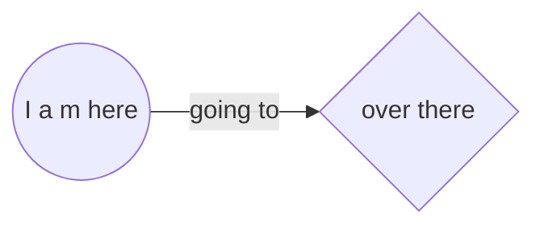

## Here, I am organizing my Markdown experiments.

Let's go writing good documentations. 🙂

It has been a funny task, because I love to learn new things everyday.

I will use this skill to enhance my README.md files.

### How about today `21/02/2022` (I've read a lot ...)

Today, I explored [`emoji-cheat-sheet`](https://github.com/ikatyang/emoji-cheat-sheet/blob/master/README.md)

A lot of possibilities.

Examples:

- ```:octocat:``` shows :octocat:
- ```:brazil:``` shows :brazil:
- ```:ninja:``` show :ninja:

I am also begining my learning path of [some advanced formatting](https://docs.github.com/en/get-started/writing-on-github/working-with-advanced-formatting)

Example I am curious about: [Creating diagrams](https://docs.github.com/en/get-started/writing-on-github/working-with-advanced-formatting/creating-diagrams)

:atom: 17/04/2022: I just found this great site about [Mermaid Live editor](https://mermaid.live/).

Using this live editor is much easier to draw diagrams. 🤫



### Next episode

<details><summary>Next time I will explore this feature.</summary>
<p>
  
  ```javascript
    console.log("Hello world"); 😃
  ```
  
</p>
</details>
